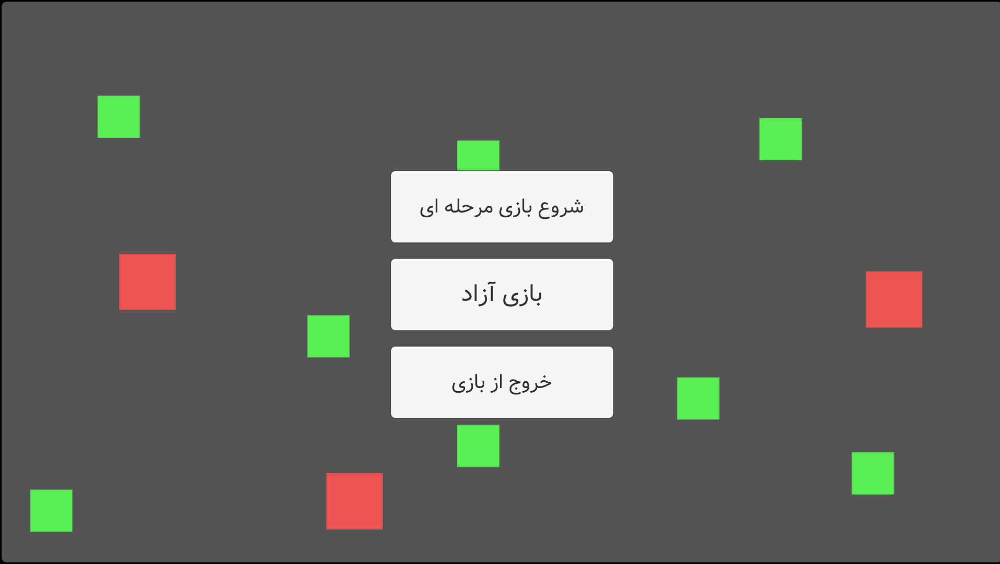
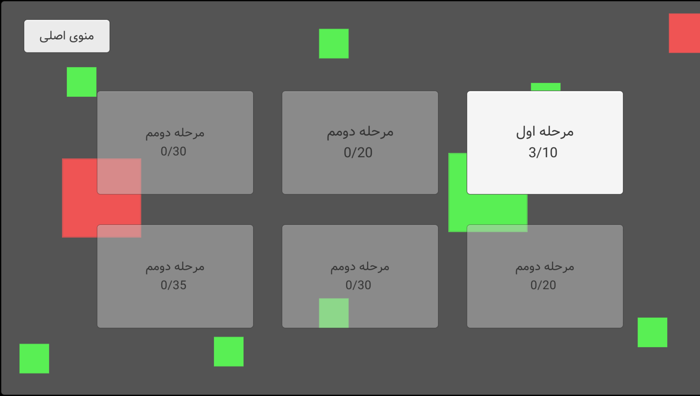
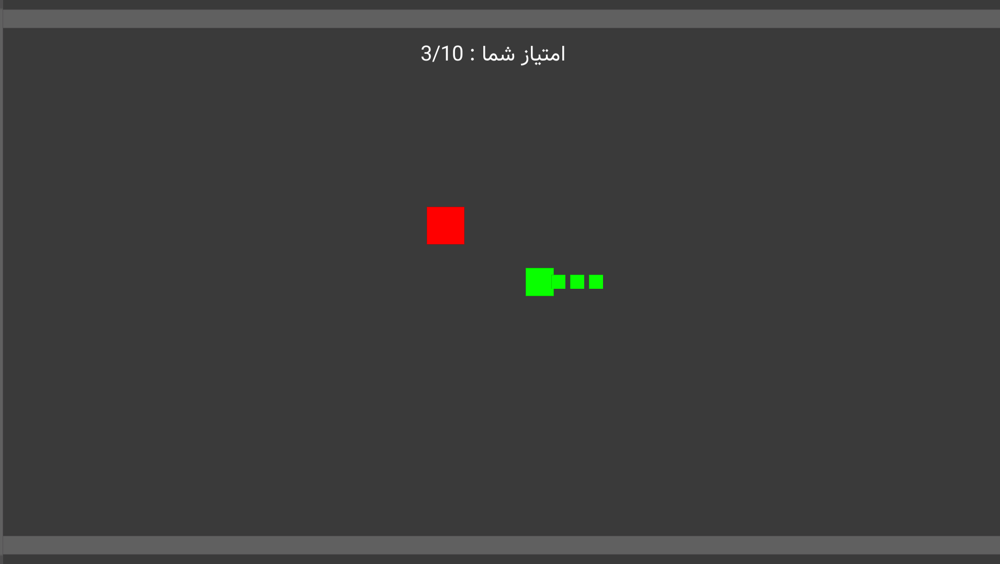

# Snake Game - My First Unity Game

Welcome to my first game project, "Snake Game," developed in Unity! 🎮  
I created this game during my third year of university, and it holds a special place in my heart as it was my first step into game development. 🐍  
While it's not the most professional game, it was an important learning experience. The journey of building this game brought back great memories, and I’m proud to share it with you.  
I hope you enjoy playing it as much as I enjoyed creating it. Any feedback or suggestions are greatly appreciated! Thank you for checking it out! 😊

---

# بازی مار - اولین بازی یونیتی من

به اولین پروژه بازی من، «مار بازی»، خوش آمدید! 🎮  
این بازی رو در سال سوم دانشگاه ساختم و برای من یادآوری خوبی از اولین قدم‌هایم در دنیای توسعه بازیه. 🐍  
اگرچه بازی خیلی حرفه‌ای نیست، اما تجربه‌ای ارزشمند بود. روند ساخت این بازی خاطرات فوق‌العاده‌ای برای من به همراه داشت و خیلی خوشحالم که می‌تونم این رو با شما به اشتراک بذارم.  
امیدوارم از بازی کردنش به اندازه‌ای که من از ساختنش لذت بردم، لذت ببرید. هر بازخوردی داشته باشید، خوشحال می‌شم بشنوم! از اینکه این بازی رو دیدید، متشکرم! 😊

### Screenshot اسکرین شات

 

 

